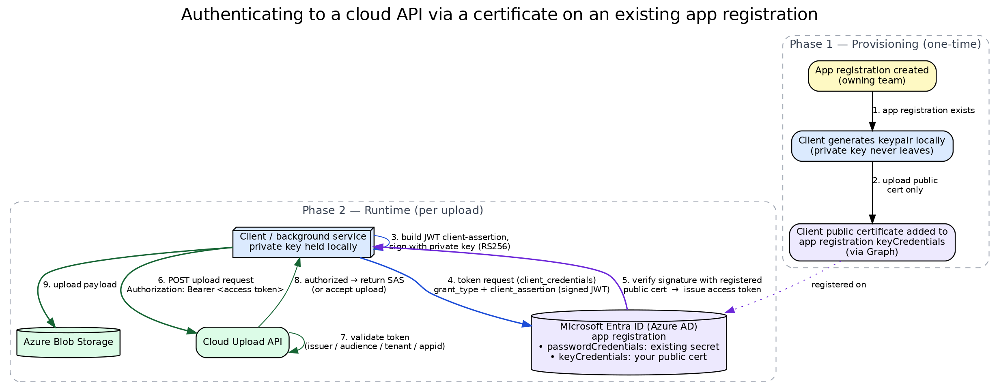

# Add your own certificate to an existing Azure app registration

**Question:** A background service on a customer machine needs to authenticate to a
cloud upload API. There is already a per-tenant Azure AD *app registration* for that
customer, created and owned by another team, secured with a client secret. Can a second
consumer authenticate through the same app registration **without** sharing that team's
secret?

**Answer:** Yes. An app registration holds **two independent credential collections** —
`passwordCredentials` (client secrets) and `keyCredentials` (certificates) — and both are
**lists**, so many credentials can be valid at once. The second consumer adds its **own
certificate** to `keyCredentials`: it keeps the private key locally and registers only the
public cert. It then authenticates with a signed JWT client-assertion. Nothing is shared,
and the two consumers rotate their credentials independently.

## The two credential types

Every app registration exposes a "Certificates & secrets" surface with two kinds of
credential. They are intrinsic — no tenant setting, license, or manifest flag turns
`keyCredentials` on; it is there by default.

| | `passwordCredentials` (secret) | `keyCredentials` (certificate) |
|---|---|---|
| What Azure stores | the **secret string** itself | only the **public** cert/key |
| Where the secret lives | in Azure (and wherever the client copied it) | private key **never leaves** the client |
| How you prove identity | send the secret as a bearer credential | send a **JWT you signed** with the private key |
| Can there be several? | yes — it's a list | yes — it's a list |

Because both are lists, one app registration can carry team A's secret and team B's cert
at the same time, all valid in parallel. Team B never sees team A's secret, and either can
roll their own credential without touching the other's.

## Why the certificate is the stronger choice

With a client secret, the actual secret travels on the wire to the token endpoint (TLS
protects it in transit, but the same string is reused every time and is copied wherever the
client runs). With a certificate, the private key never moves. Each token request carries
only a **short-lived JWT client-assertion** signed with that key (RS256). An attacker who
sniffs or logs a request gets a one-time signed assertion, not a reusable credential.

## The flow

Two phases. Provisioning happens once per tenant; the runtime path runs on every upload.

**Phase 1 — provisioning (one-time)**
1. The owning team's service creates the per-tenant app registration.
2. The client generates a keypair **locally** — the private key never leaves the machine.
3. The client's **public certificate** is added to the app registration's `keyCredentials`
   (via Microsoft Graph), alongside any existing secret.

**Phase 2 — runtime (per request)**
4. The client builds a JWT client-assertion and signs it with its private key (RS256).
5. It calls the Entra token endpoint with a `client_credentials` grant, passing the signed
   JWT as `client_assertion`.
6. Entra verifies the signature against the **registered public cert** and issues an access
   token.
7. The client calls the upload API with `Authorization: Bearer <access token>`.
8. The API validates the token's issuer / audience / tenant / app id and authorizes the call.
9. The client uploads its payload to blob storage.

## Takeaways

- An app registration has **two credential lists**: secrets (`passwordCredentials`) and
  certs (`keyCredentials`) — both can hold multiple entries, all valid at once.
- `keyCredentials` stores only the **public** cert; the private key stays on the client.
  This is on by default for every app registration.
- Adding your own cert to a shared app registration lets a second consumer authenticate
  **without sharing anyone's secret**, and lets each consumer rotate independently.
- Certificate (JWT client-assertion, RS256) auth is stronger than a shared secret because
  the credential itself never travels — only a short-lived signed assertion does.
